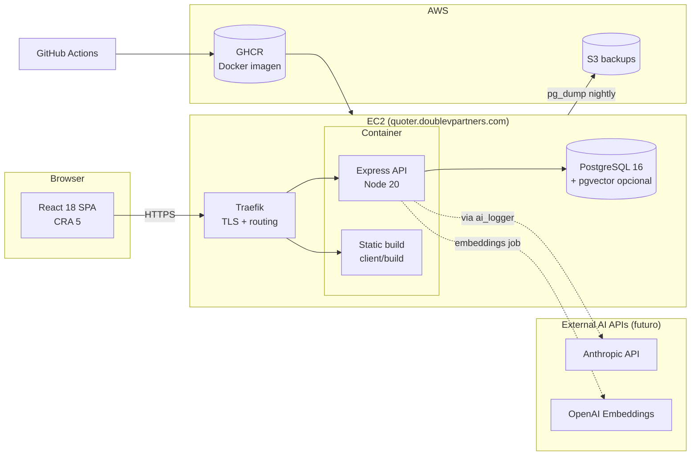
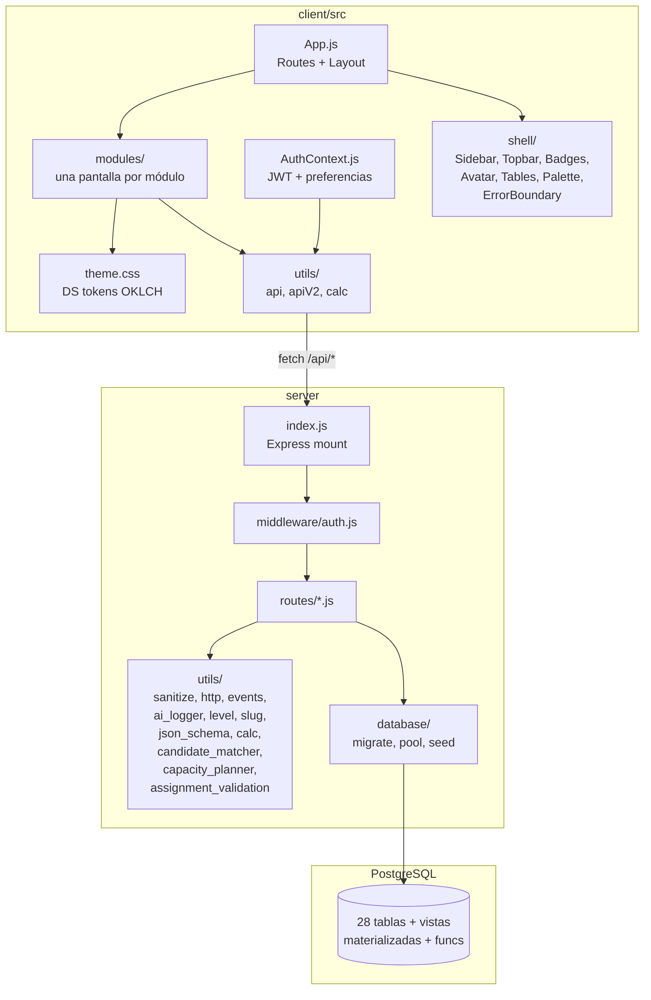
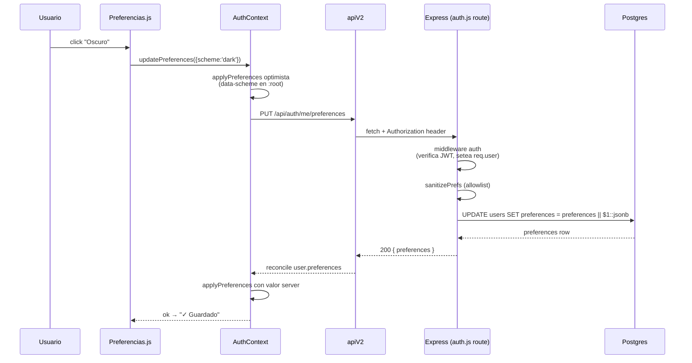
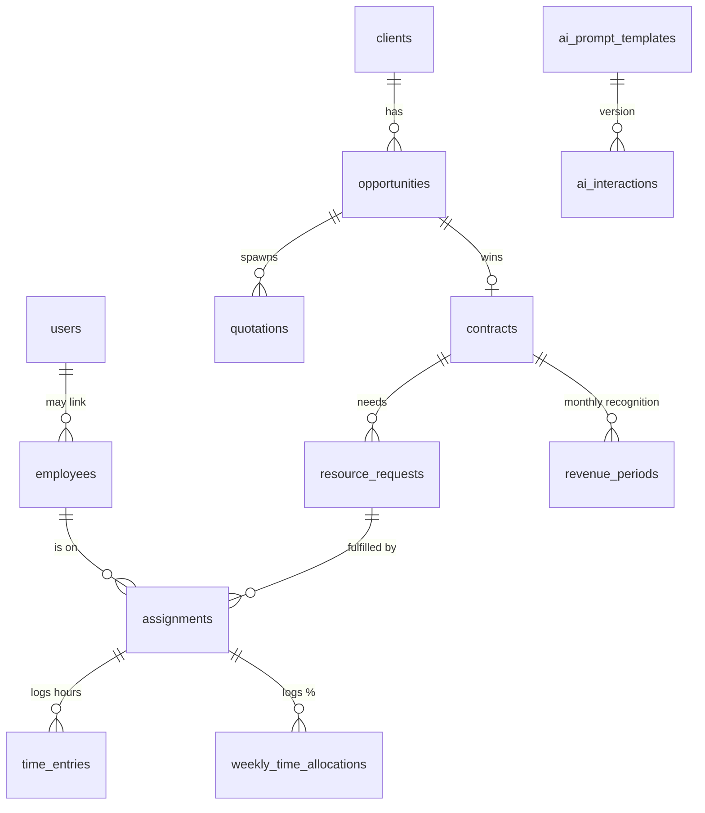

# Arquitectura — DVPNYX Quoter + Capacity Planner

Vista técnica del sistema. Pensado para que un ingeniero nuevo entienda **cómo fluye una request** desde el browser hasta la DB, **por qué** el código está organizado así, y **dónde** tocar para agregar algo nuevo sin romper el resto.

> **Última revisión:** 2026-05-01 (housekeeping pase). Refleja main al día con: AI-readiness, sortable tables (Phase 17), endpoints `/lookup` para selectores, defense-in-depth con SAVEPOINT en helpers de side-effects (`notify`, `emitEvent`), optimizaciones PERF-001/002/003. Ver `docs/INCIDENTS.md` para los aprendizajes operativos detrás de varios de estos cambios.

---

## Índice

1. [Vista macro](#1-vista-macro)
2. [Vista de código](#2-vista-de-código)
3. [Stack tecnológico](#3-stack-tecnológico)
4. [Vida de una request](#4-vida-de-una-request)
5. [Modelo de datos (resumen)](#5-modelo-de-datos-resumen)
6. [Capa AI-readiness](#6-capa-ai-readiness)
7. [Convenciones del backend](#7-convenciones-del-backend)
8. [Convenciones del frontend](#8-convenciones-del-frontend)
9. [Flujos end-to-end](#9-flujos-end-to-end)
10. [Seguridad y auth](#10-seguridad-y-auth)
11. [Design System](#11-design-system)
12. [Puntos de extensión](#12-puntos-de-extensión)
13. [Anti-patterns conocidos](#13-anti-patterns-conocidos)

---

## 1. Vista macro



**Características clave:**
- Un solo binario Docker sirve API (`/api/*`) + build estático del cliente (resto).
- `index.html` con `Cache-Control: no-cache` para evitar bundles viejos post-deploy.
- Traefik termina TLS (Let's Encrypt) y matchea por host (`quoter.…` → prod, `dev.quoter.…` → dev).
- Postgres en mismo host. Stack CDK en `infra/` tiene path a RDS managed cuando se active.
- pgvector es **opcional** — si la imagen Postgres no lo tiene, el sistema migra normal sin la capa de embeddings.

---

## 2. Vista de código



### `client/`

- `App.js` — `<BrowserRouter>` + `<Layout>` + todas las rutas. Resistir tentación de split hasta que duela.
- `AuthContext.js` — JWT en `localStorage`, hidratación al mount, `updatePreferences()` con optimistic UI + rollback (sin stale closure).
- `theme.css` — **fuente única** de tokens DS (`--ds-*`, `--accent-hue`, `--density`, `[data-scheme="dark"]`).
- `modules/Foo.js` + `modules/FooDetail.js` — un archivo por pantalla. Estilos inline con tokens. Test paralelo.
- `shell/` — componentes reusables (`StatusBadge`, `Avatar`, `CommandPalette`, `Sidebar`, `NotificationsDrawer`, `ErrorBoundary`, `tableStyles`).
- `utils/api.js` — cliente legacy V1 (todavía usado por cotizaciones).
- `utils/apiV2.js` — cliente moderno (`apiGet/Post/Put/Delete`) para todos los módulos nuevos.
- `utils/calc.js` — motor de cálculo de cotizaciones (mismo en server).

### `server/`

- `index.js` — orquesta middleware + rutas + static + error handler.
- `middleware/auth.js` — `auth` (JWT verify, setea `req.user`) + `adminOnly` + `superadminOnly` + `requireRole(...)`. Normaliza `preventa` → `member` + `function='preventa'`.
- `routes/<entidad>.js` — una por dominio. Patrón: pagination via `parsePagination`, errors via `serverError`, transacciones via `safeRollback`. Ver [`docs/CONVENTIONS.md §2`](docs/CONVENTIONS.md#2-server-rutas-express).
- `utils/sanitize.js` — `parsePagination`, `parseFiniteInt/Number`, `isValidUUID`, `isValidISODate`, `mondayOf`.
- `utils/http.js` — `serverError(res, where, err)` + `safeRollback(conn, where)`.
- `utils/events.js` — `emitEvent(pool, payload)` → INSERT en `events` table. `buildUpdatePayload(before, after, fields)`.
- `utils/level.js` — mapeo bidireccional INT ↔ `Lx`.
- `utils/slug.js` — `slugify` + `uniqueSlug`.
- `utils/json_schema.js` — validador liviano de JSONB con `SCHEMAS` predefinidos.
- `utils/ai_logger.js` — wrapper `run()` + `recordDecision()` para llamadas a agentes IA.
- `utils/calc.js` — motor de cálculo (cotizaciones).
- `utils/candidate_matcher.js` — scoring puro de candidatos (US-RR-2). Listo para reemplazo por embeddings semánticos.
- `utils/capacity_planner.js` — cálculo de utilización por semana.
- `utils/assignment_validation.js` — overbooking + área + level + overlap (US-BK-2).
- `database/migrate.js` — DDL idempotente (corre en cada deploy). 5 secciones: V1_SCHEMA, V2_NEW_TABLES, V2_ALTERS, AI_READINESS_SQL, V2_SEEDS_SQL.
- `database/pool.js` — pg pool config.
- `database/seed.js` — datos demo (no corre en prod).

---

## 3. Stack tecnológico

| Capa | Tecnología |
|---|---|
| Frontend | React 18 + react-router-dom 6, Create React App 5, fonts `@fontsource/*`, design tokens CSS OKLCH |
| Backend | Node 20 + Express 4, `pg` driver nativo, JWT (`jsonwebtoken`), `helmet`, `express-rate-limit`, `bcryptjs` |
| DB | PostgreSQL 16 (con `uuid-ossp` siempre, `vector` opcional) |
| Packaging | Dockerfile multi-stage; `client/build` servido por el mismo Express en prod |
| Reverse proxy | Traefik (TLS + host rule) |
| CI/CD | GitHub Actions → GHCR → EC2. Pipelines: `develop-ci`, `deploy`, `deploy-dev`, `rollback`, `aws-infra`, `backup-nightly` |
| Testing | Jest + supertest (server, 638 tests) · Jest + React Testing Library (client, 325/327) |
| AI futuro | Anthropic API (Claude) + OpenAI embeddings — wiring vía `utils/ai_logger.js` |
| Infra alterna | AWS CDK (TypeScript) en `infra/` — stack listo para activar |

---

## 4. Vida de una request

Ejemplo: usuario marca preferencia de tema oscuro.



**Cosas a destacar:**
- **Optimistic UI**: tema flip instantáneo en `:root` antes de respuesta.
- **Rollback con captura previa**: `AuthContext.updatePreferences` captura `previousPrefs` al inicio del closure. Si el PUT falla, revierte a esa snapshot — no a `user?.preferences` actual (que podría haberse modificado concurrentemente).
- **Sanitización en server**: el cliente puede mandar basura. Server filtra a allowlist.
- **Partial JSON merge**: `preferences || $1::jsonb` permite PATCHear sin borrar otras claves.
- **Auth en middleware**: handlers nunca re-verifican JWT. `req.user.id` es confiable.

---

## 5. Modelo de datos (resumen)

28 tablas. Detalle completo: [`docs/specs/v2/03_data_model.md`](docs/specs/v2/03_data_model.md).



**Convenciones V2:**
- UUID PK, soft delete (`deleted_at`), TIMESTAMPTZ, autoría (`created_by`, `updated_by`).
- Estados como `VARCHAR(20)` con CHECK (sin tipos ENUM Postgres — facilita migraciones).
- JSONB para shapes que evolucionan, validados con `utils/json_schema.js`.
- Indexes parciales `WHERE deleted_at IS NULL`.

---

## 6. Capa AI-readiness

Agregada mayo 2026. Aditiva, sin romper nada existente. Ver [`docs/AI_INTEGRATION_GUIDE.md`](docs/AI_INTEGRATION_GUIDE.md) completo.

**Schema:**
- `ai_interactions` — log de cada llamada a un agente.
- `ai_prompt_templates` — prompts versionados.
- `delivery_facts` — denormalizada por (date, employee) para forecasting.
- 7 columnas `*_embedding vector(1536)` con HNSW indexes (si pgvector activo).

**Helpers:**
- `utils/ai_logger.js :: run({ pool, agent, template, userId, entity, input, call })` — wrapper obligatorio.
- `utils/ai_logger.js :: recordDecision(pool, id, decision, feedback)` — feedback loop.

**Endpoints:**
- `GET /api/ai-interactions` (admin) — browse del log.
- `POST /api/ai-interactions/:id/decision` — registra decisión humana.

**Materialized view:**
- `mv_plan_vs_real_weekly` — pre-calcula plan-vs-real (refresh CONCURRENTLY).
- Function `refresh_delivery_facts(p_from, p_to)` — idempotente, lista para cron job.

---

## 6.1 Sistema de alertas CRM (SPEC-CRM-00 v1.1)

Agregada mayo 2026 — capa de detección + dedup sobre la infraestructura de notificaciones existente. Ver [`server/utils/alerts.js`](server/utils/alerts.js) (205 LOC, autocontenido) + [`CHANGELOG.md`](CHANGELOG.md) para detalle por PR.

**Definiciones (`ALERT_DEFS` en `alerts.js`):**

| Código | Disparador | Severidad | Acción |
|---|---|---|---|
| `A1_STALE` | Oportunidad sin transición de estado por >30 días | Medium | Notificación al account_owner + lead |
| `A2_NEXT_STEP` | `next_step_date` vencida | High | Notificación al account_owner |
| `A3_MEDDPICC` | Avanza a `solution_design+` sin Champion o sin Economic Buyer | Medium | Notificación al account_owner; badge ⚠ A3 inline en `OpportunityDetail` |
| `A4_MARGIN_LOW` | `margin_pct < 20%` (constante `MARGIN_LOW_THRESHOLD` en `booking.js`) | High | Warning en transiciones a `proposal_validated/negotiation/verbal_commit/closed_won`; emite evento `opportunity.margin_low` |
| `A5_CLOSE_SOON` | `expected_close_date` dentro de 7 días sin estar cerrada | Medium | Notificación al account_owner + lead |

**Helpers:**
- `createAlertNotification(pool, alertCode, opportunityId, userId, payload)` — INSERT con dedup 24h (`WHERE NOT EXISTS` matching alertCode + opportunityId + userId en últimas 24h).
- `runAlertScan({ pool, scopeUserId, scopeRole })` — scanner con scoping por rol (`SEE_ALL_ROLES` ven todo, `lead` ve squad, `member` ve sus opps).
- `checkA3({ status, championIdentified, economicBuyerIdentified })` — utility pura para el inline check.

**Endpoint:**
- `POST /api/opportunities/check-alerts` — invoca `runAlertScan` para el caller. Diseñado para cron diario o ejecución manual.

**Pattern:**
- A3 dispara fire-and-forget en `POST /:id/status` (al avanzar) y `PUT /:id` (al cambiar champion/EB flags) — no bloquea la transición.
- A4 dispara en `POST /:id/check-margin` y como warning en `POST /:id/status`.
- A1, A2, A5 son scheduled (vía endpoint cron) — no dependen de un event runtime.

---

## 7. Convenciones del backend

Ver [`docs/CONVENTIONS.md`](docs/CONVENTIONS.md) para detalle. Resumen:

```js
// Patrón estándar de ruta
router.use(auth);

router.get('/', async (req, res) => {
  try {
    const { page, limit, offset } = parsePagination(req.query);
    const filterParams = [];
    const add = (v) => { filterParams.push(v); return `$${filterParams.length}`; };
    if (req.query.x) wheres.push(`x = ${add(req.query.x)}`);
    const limitIdx = filterParams.length + 1;
    const offsetIdx = filterParams.length + 2;
    const { rows } = await pool.query(
      `SELECT ... LIMIT $${limitIdx} OFFSET $${offsetIdx}`,
      [...filterParams, limit, offset]
    );
    res.json({ data: rows, pagination: { page, limit, ... } });
  } catch (err) { serverError(res, 'GET /things', err); }
});
```

**Reglas clave:**
- Todo `try/catch` cierra con `serverError(res, where, err)`.
- Transacciones con `safeRollback(conn, where)` + `finally { conn.release(); }`.
- SQL siempre parameterizado ($1, $2, ...).
- `WHERE deleted_at IS NULL` en todo SELECT de prod.
- Eventos via `emitEvent(pool, ...)` después de cada mutation.
- Tests cubren happy path + 4xx específicos + permisos.

---

## 8. Convenciones del frontend

```js
// ✅ tokens DS
const s = {
  card: {
    background: 'var(--ds-surface)',
    border: '1px solid var(--ds-border)',
    color: 'var(--ds-text)',
    padding: 16,
    borderRadius: 'var(--ds-radius, 6px)',
  },
};

// ✅ defensive nullables
const data = await apiGet('/api/things');
const list = data?.data || [];

// ✅ keys con id, no index
{list.map((it) => <Row key={it.id} {...it} />)}

// ✅ useAuth tolerante a tests sin provider
const auth = useAuth() || {};
const isAdmin = !!auth.isAdmin;
```

**Reglas:**
- Estilos siempre con tokens DS (`var(--ds-*)`).
- Cleanup en `useEffect` (cancellation de fetches con `let alive = true`).
- ErrorBoundary global en `App.js` para que un crash en una ruta no tumbe la app entera.
- StatusBadge / Avatar / tableStyles del shell — no reimplementar.

---

## 9. Flujos end-to-end

### 9.1 Quote → Contract → Kick-off → Assignment

1. Crear cliente → oportunidad → cotización (staff_aug o fixed_scope).
2. Marcar oportunidad como `won` → confirma "crear contrato" → `POST /api/contracts/from-quotation/:id` crea contract `planned`.
3. Admin asigna `delivery_manager_id` desde ContractDetail.
4. Delivery manager presiona "Iniciar kick-off" + `kick_off_date` → sistema lee winning_quotation y crea resource_requests automáticos.
5. DM o admin crea assignments desde Capacity Planner (modal de candidatos) o desde ResourceRequest.
6. Validation engine valida overbooking / área / level / overlap. Override estructurado si admin lo justifica.

### 9.2 Plan → Real

1. Empleado registra % semanal en `/time/team` (o admin/lead lo registra para ellos).
2. Plan-vs-real reporte (`/reports/plan-vs-real`) compara `assignments.weekly_hours / capacity` vs `weekly_time_allocations.pct`.
3. Status por línea: `on_plan | over | under | missing | unplanned | no_data` con tolerancia ±10pp.
4. Auto-scoping por rol: lead → su equipo, member → él mismo, admin → todos.

### 9.3 AI-augmented (próximo paso)

1. Endpoint llama a `ai_logger.run()` con context.
2. Agente devuelve sugerencia → registrada en `ai_interactions` con `__interactionId`.
3. UI muestra sugerencia. Usuario acepta/rechaza/modifica/ignora.
4. UI llama `POST /api/ai-interactions/:id/decision` cerrando el feedback loop.
5. Admin browsea log en `GET /api/ai-interactions` para mejorar prompts.

---

## 10. Seguridad y auth

Ver [`SECURITY.md`](SECURITY.md). Resumen:

- JWT en `Authorization: Bearer <jwt>`, stateless, 8h TTL.
- Passwords en `bcrypt` cost 12.
- Rate limit global + específico para login.
- Roles: `superadmin > admin > lead > member > viewer`. Middleware `adminOnly` agrupa admin+superadmin; `requireRole(...)` para granular.
- `users.function` (comercial / preventa / delivery / capacity / finance) para visibilidades futuras.
- **Sin RLS** — permisos en app code.
- **Sin MFA** todavía.

---

## 11. Design System

Tokens en `client/src/theme.css`:

```css
:root {
  --accent-hue: 270;
  --density: 1.0;
  --font-ui: 'Inter', sans-serif;
  --font-mono: 'JetBrains Mono', monospace;

  --ds-accent:       oklch(0.55 0.15 var(--accent-hue));
  --ds-accent-soft:  oklch(0.93 0.06 var(--accent-hue));
  --ds-text:         /* derivado via data-scheme */
  --ds-surface:      /* … */
  --ds-border:       /* … */
  --ds-ok / --ds-warn / --ds-bad: /* semáforos */
  --ds-radius:       6px;
  --ds-row-h:        calc(32px * var(--density));
}

[data-scheme="dark"] { /* re-define neutrales */ }
```

Para cambiar paleta del producto: mover `--accent-hue`. Todo se re-deriva via OKLCH.
Para dark mode: `document.documentElement.setAttribute('data-scheme', 'dark')` (lo hace `AuthContext.applyPreferences`).

---

## 12. Puntos de extensión

| Cambio | Empezar por |
|---|---|
| Endpoint nuevo | Copiar `server/routes/skills.js` + su test |
| Pantalla nueva | Copiar `client/src/modules/Areas.js` + test + registrar en `App.js` y `Sidebar.js` |
| Preferencia de usuario | `ALLOWED_PREF_KEYS` en `routes/auth.js` + `Preferencias.js` + `AuthContext.applyPreferences` |
| Status/tono nuevo | `shell/StatusBadge.js :: TONE_MAP[domain][value]` |
| Migrar tabla | Push al final de `V2_ALTERS` o `AI_READINESS_SQL` en `migrate.js`, idempotente |
| Reporte nuevo | `routes/reports.js` + `modules/Reports.js :: COLUMNS` |
| Cambiar paleta base | Mover `--accent-hue` default en `theme.css` |
| Conectar agente IA | `utils/ai_logger.js :: run({...})`. Ver [`AI_INTEGRATION_GUIDE.md §2`](docs/AI_INTEGRATION_GUIDE.md#2-tu-primera-integración-en-30-minutos) |
| Validar JSONB nuevo | `utils/json_schema.js :: SCHEMAS.foo = {...}` |

---

## 13. Anti-patterns conocidos

❌ **No hagas:**

- Hardcodear colores hex fuera de `theme.css`.
- `console.log` en código de producción.
- `SELECT *` en respuestas HTTP (filtra password_hash, embeddings de varios KB).
- String interpolation en SQL con valores de `req`.
- `res.status(500)` directo sin `serverError()`.
- `pool.connect()` sin `finally { conn.release(); }`.
- ROLLBACK silencioso `.catch(()=>{})`. Usar `safeRollback`.
- Clases CSS con nombres propios. Usar tokens o componente del shell.
- Llamar a un agente IA sin pasar por `ai_logger.run()`.
- `key={index}` en listas con IDs disponibles.
- Nuevas libs grandes sin discutirlo con PO.
- `setTimeout`/`setInterval` huérfanos sin cleanup.
- `dangerouslySetInnerHTML` sin code review obligatorio.

---

*Si este doc se desactualiza, mejor borrar la sección desfasada que dejar mentiras. La fuente de verdad es el código.*
