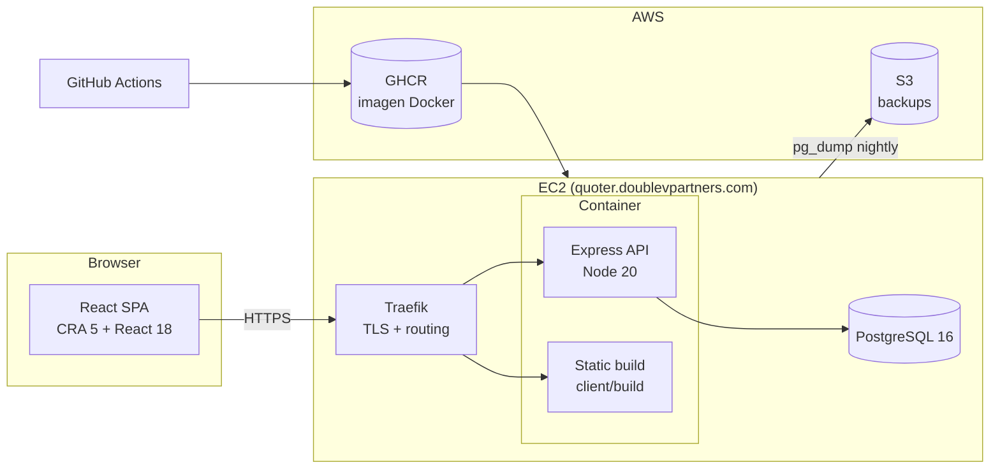
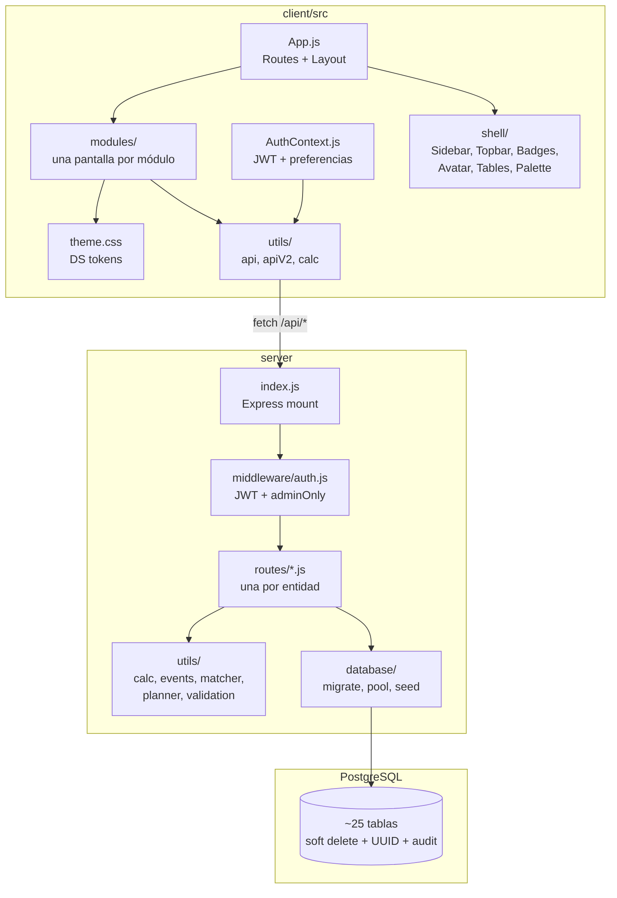
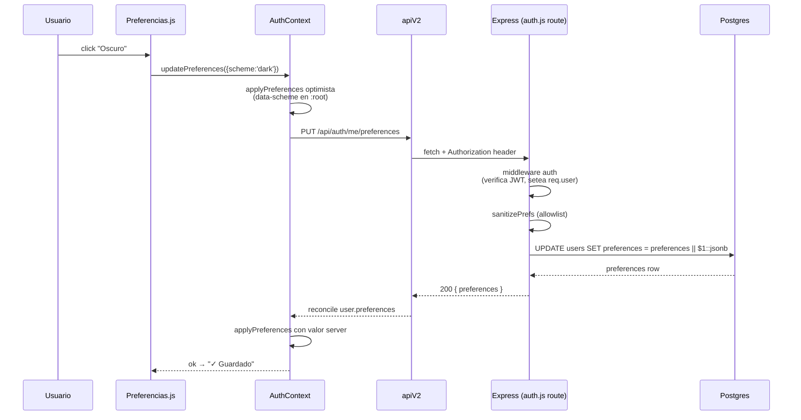
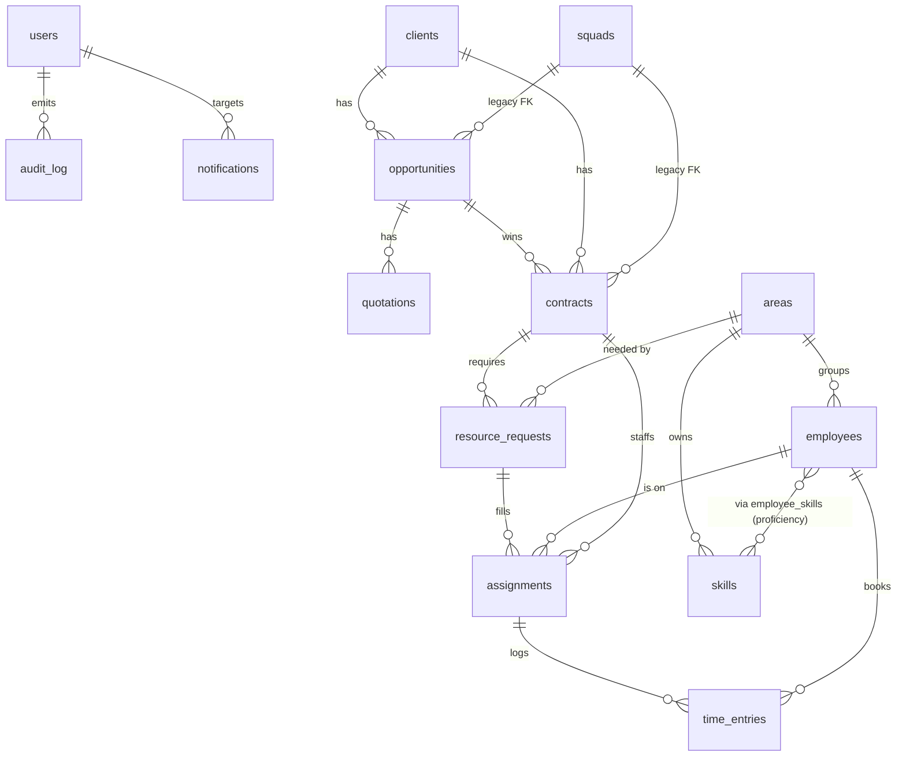

# Arquitectura — DVPNYX Quoter + Capacity Planner

Vista técnica del sistema. Pensado para que un ingeniero nuevo entienda **cómo fluye una request** desde el browser hasta la DB, **por qué** el código está organizado así, y **dónde** tocar para agregar algo nuevo sin romper el resto.

---

## 1. Vista macro



- **Un solo binario Docker** sirve tanto el API (`/api/*`) como el build estático del cliente (resto de paths). En prod el `index.html` pasa por `Cache-Control: no-cache` para evitar clientes colgados de un bundle viejo después de un deploy.
- **Traefik** termina TLS (Let's Encrypt) y matchea por host (`quoter.…` → prod container, `dev.quoter.…` → dev container).
- **Postgres** corre en el mismo host por ahora. El stack CDK en `infra/` tiene la ruta a RDS managed cuando se active.

---

## 2. Vista de código



### client/

- `App.js` — `<BrowserRouter>` + `<Layout>` + declaración de todas las rutas. Un solo archivo ~700 líneas porque es la fuente de verdad de qué módulos existen; resistir la tentación de split-it hasta que esto se vuelva doloroso.
- `AuthContext.js` — JWT en `localStorage`, hidratación del user al mount, `updatePreferences()` con optimistic UI + rollback.
- `theme.css` — **fuente única de los tokens del design system** (`--ds-*`, `--accent-hue`, `--density`, `[data-scheme="dark"]`). Cualquier color nuevo empieza acá.
- `modules/Foo.js` + `modules/FooDetail.js` — un archivo por pantalla. Estilos inline referenciando tokens. Import de `apiV2` para hacer fetch. Test file paralelo `Foo.test.js`.
- `shell/` — componentes reusables (`StatusBadge`, `Avatar`, `CommandPalette`, `Sidebar`, `NotificationsDrawer`, `tableStyles`). Todo el DS centralizado vive acá.
- `utils/api.js` — cliente legacy (V1) que todavía usan cotizaciones.
- `utils/apiV2.js` — cliente moderno (`apiGet/Post/Put/Delete`) para todos los módulos nuevos.
- `utils/calc.js` — motor de cálculo de cotizaciones (replica lógica del Excel original).

### server/

- `index.js` — `require + app.use` de cada módulo de rutas + static files + error handler. Orden importa solo por rate-limits (login limiter antes del handler).
- `middleware/auth.js` — dos exports: `auth` (JWT verify, setea `req.user`) y `adminOnly` (encadena `auth` + chequeo de role ≥ admin).
- `routes/<entidad>.js` — una por dominio. Patrón: `router.get/post/put/delete`, SQL parametrizada directa con `pool.query(sql, [args])`, emisión de eventos con `utils/events.js`, soft delete con `deleted_at IS NULL`.
- `utils/calc.js` — **mismo motor** que el cliente, empaquetado para server-side (quotations endpoint).
- `utils/candidate_matcher.js` — scoring puro de candidatos para resource requests (US-RR-2). Tests unitarios paralelos.
- `utils/capacity_planner.js` — cálculo de utilización por semana (US-BK-1).
- `utils/assignment_validation.js` — overbooking + solapamiento (US-BK-2).
- `utils/events.js` — `emitEvent(pool, payload)` → INSERT en `events` table.
- `database/migrate.js` — DDL idempotente. Corre en cada deploy.
- `database/migrate_v2_data.js` — seeds V2 (roles, squad global, etc). **NO corre en dev automáticamente.**
- `database/seed.js` — datos demo para local.

---

## 3. Vida de una request

Ejemplo: usuario marca una preferencia de tema oscuro.



**Cosas a destacar:**

- **Optimistic UI**: el flip de tema se aplica instantáneamente en `:root` antes de que la red responda. Si el PUT falla, `AuthContext` hace rollback con el estado previo.
- **Sanitización en el server**: `sanitizePrefs` solo deja pasar las 3 claves permitidas y valida rango. El cliente podría mandar basura — no confiamos.
- **Partial merge en SQL**: `preferences || $1::jsonb` permite PATCHear una sola clave sin borrar las otras.
- **Auth siempre en middleware**: el handler de la ruta nunca re-verifica el JWT. `req.user.id` es confiable.

---

## 4. Modelo de datos

Tablas principales (el detalle completo vive en `server/database/migrate.js`):



### Convenciones en todas las tablas V2

- `id UUID PRIMARY KEY DEFAULT gen_random_uuid()`
- `created_at TIMESTAMPTZ NOT NULL DEFAULT NOW()`
- `updated_at TIMESTAMPTZ NOT NULL DEFAULT NOW()`
- `deleted_at TIMESTAMPTZ NULL` — **soft delete**. Todo SELECT de producción filtra por `deleted_at IS NULL`.
- `created_by`, `updated_by` → `users.id` (FK, nullable en seeds).
- Status enumerados vía `CHECK (status IN (…))` — no usamos ENUM types de Postgres para no bloquear migraciones.
- Campos `JSONB` cuando queremos evolucionar sin migración (`users.preferences`, ciertos metadata).

### Eventos y audit log

- `audit_log` → registra login, cambios de password, acciones admin críticas. Schema: `user_id, action, details JSONB, ip_address, created_at`.
- `events` → event sourcing ligero, escrito desde `utils/events.js`. Hoy **se emite pero no se consume** (no hay UI que muestre histórico — es stub).

---

## 5. Convenciones del backend

### Rutas (patrón estándar de `routes/*.js`)

```js
const router = require('express').Router();
const pool = require('../database/pool');
const { auth, adminOnly } = require('../middleware/auth');

router.use(auth);          // toda la ruta requiere login
// router.use(adminOnly);  // descomenta si toda la ruta es admin-only

router.get('/', async (req, res) => {
  try {
    const { rows } = await pool.query(
      `SELECT id, name FROM entities WHERE deleted_at IS NULL ORDER BY name`,
    );
    res.json(rows);
  } catch (err) { console.error(err); res.status(500).json({ error: 'Error interno' }); }
});

router.post('/', adminOnly, async (req, res) => {
  try {
    const { name } = req.body;
    if (!name) return res.status(400).json({ error: 'name requerido' });
    const { rows } = await pool.query(
      `INSERT INTO entities (name, created_by) VALUES ($1, $2) RETURNING *`,
      [name, req.user.id],
    );
    // emitir evento
    require('../utils/events').emitEvent(pool, {
      entity_type: 'entity', entity_id: rows[0].id,
      type: 'entity.created', payload: { name }, actor_id: req.user.id,
    });
    res.status(201).json(rows[0]);
  } catch (err) { console.error(err); res.status(500).json({ error: 'Error interno' }); }
});

module.exports = router;
```

### Tests de ruta (patrón estándar)

```js
// server/routes/foo.test.js
const { makeClient, queryQueue, issuedQueries } = require('../test_helpers/http_client');
const client = makeClient(require('./foo'));

beforeEach(() => { queryQueue.length = 0; issuedQueries.length = 0; });

it('GET / returns rows', async () => {
  queryQueue.push({ rows: [{ id: '1', name: 'X' }] });
  const res = await client.call('GET', '/');
  expect(res.status).toBe(200);
  expect(res.body).toEqual([{ id: '1', name: 'X' }]);
});
```

`test_helpers/http_client` inyecta un pool mockeado — las pruebas nunca tocan DB real.

---

## 6. Convenciones del frontend

### Estilos

```js
// ✅ estilos inline con tokens DS
const s = {
  card: {
    background: 'var(--ds-surface)',
    border: '1px solid var(--ds-border)',
    borderRadius: 'var(--ds-radius, 6px)',
    padding: 16,
  },
  title: { fontSize: 13, fontWeight: 600, color: 'var(--ds-text)' },
};

export default function Foo() {
  return (
    <div style={s.card}>
      <h3 style={s.title}>Hola</h3>
    </div>
  );
}

// ❌ no hacer esto
const bad = { background: '#ffffff', color: '#1e0f1c' }; // hardcoded
```

### Fetching

```js
import { apiGet, apiPost } from '../utils/apiV2';

useEffect(() => {
  let alive = true;
  apiGet('/clients').then((data) => { if (alive) setClients(data); });
  return () => { alive = false; };
}, []);
```

### Estados de UI

Usar los componentes del shell:

```jsx
import StatusBadge from '../shell/StatusBadge';
import Avatar from '../shell/Avatar';

<StatusBadge domain="contract" value={c.status} />
<Avatar name={employee.name} size={28} />
```

No reimplementar chips / badges / círculos de inicial en cada módulo. Si falta un dominio en `StatusBadge.TONE_MAP`, agregarlo ahí.

---

## 7. Flujos end-to-end importantes

### 7.1 Quote → Contract

1. Usuario crea cliente (`Clients`) → oportunidad (`Opportunities`) → cotización (`NewQuotationPreModal` → editor staff aug o fixed scope).
2. Al "ganar" la oportunidad, el admin crea un contrato desde `OpportunityDetail`. Puede linkearlo a la cotización ganadora.
3. Contrato queda en `planned`, pasa a `active` cuando el admin lo activa.

### 7.2 Contract → Staffing

1. Desde `ContractDetail`, usuario crea **resource requests** (ER-1, ER-2).
2. Desde un request, usuario abre **"Candidatos"** → llama `GET /api/resource-requests/:id/candidates` → ranking por `candidate_matcher.js` (US-RR-2).
3. Elige un candidato → `POST /api/assignments/validate` (pre-check) → `POST /api/assignments` si todo ok.
4. Validaciones (overbooking, solapamiento, status del empleado) las centraliza `utils/assignment_validation.js`.

### 7.3 Staffing → Billing (pendiente)

1. Empleado asignado registra horas en `TimeMe` (matriz semanal).
2. Time entries se graban en `time_entries`, ligadas al `assignment_id`.
3. **El ciclo termina acá hoy.** No hay invoicing, no hay export a contabilidad.

---

## 8. Seguridad y auth

Ver [`SECURITY.md`](SECURITY.md) para el modelo de amenazas completo. Resumen:

- JWT en header `Authorization: Bearer <jwt>`, stateless, expira en 8h.
- Passwords en `bcrypt` cost 12.
- Rate limit global + específico para login.
- Roles: `superadmin > admin > lead > member > viewer`. Hoy `adminOnly` agrupa `admin` + `superadmin`; `lead` y `viewer` están definidos pero casi no se chequean en rutas — **punto a formalizar**.

---

## 9. Design System

Tokens en `client/src/theme.css`. Los principales:

```css
:root {
  --accent-hue: 270;
  --density: 1.0;
  --font-ui: 'Inter', …;
  --font-mono: 'JetBrains Mono', …;

  --ds-accent:       oklch(0.55 0.15 var(--accent-hue));
  --ds-accent-soft:  oklch(0.93 0.06 var(--accent-hue));
  --ds-accent-text:  oklch(0.38 0.12 var(--accent-hue));
  --ds-text:         /* derivado via data-scheme */
  --ds-text-dim:     /* … */
  --ds-surface:      /* … */
  --ds-border:       /* … */
  --ds-ok / --ds-bad / --ds-warn: /* semáforos */
  --ds-radius:       6px;
  --ds-row-h:        calc(32px * var(--density));
}

[data-scheme="dark"] { /* re-define los neutrales */ }
```

Para cambiar el color del producto: mover `--accent-hue`. Todo lo demás se re-deriva via OKLCH.

Para dark mode: `document.documentElement.setAttribute('data-scheme', 'dark')`. Lo hace `AuthContext.applyPreferences()` según `users.preferences.scheme`.

Componentes reusables del DS:
- `shell/StatusBadge.js` — badges con `TONE_MAP` por dominio.
- `shell/Avatar.js` — círculo con iniciales + hue determinista.
- `shell/tableStyles.js` — objeto compartido para todas las tablas.
- `shell/CommandPalette.js` — `Cmd-K` palette.
- `shell/NotificationsDrawer.js` — drawer lateral de notificaciones.

---

## 10. Puntos de extensión sugeridos

Si el equipo entrante quiere hacer un cambio grande, estos son los puntos más limpios:

| Cambio | Empezar por |
|--------|-------------|
| Agregar un endpoint nuevo | Copiar `server/routes/skills.js` como template + su test |
| Agregar una pantalla nueva | Copiar `client/src/modules/Areas.js` + `Areas.test.js` + registrar en `App.js` y `Sidebar.js` |
| Agregar una preferencia de usuario | `ALLOWED_PREF_KEYS` en `server/routes/auth.js` + control en `client/src/modules/Preferencias.js` + aplicarla en `AuthContext.applyPreferences` |
| Agregar un status/tono nuevo | `shell/StatusBadge.js :: TONE_MAP[domain][value] = 'ok'\|'warn'\|'bad'\|'accent'` |
| Migrar una tabla | Push al final de `V2_ALTERS` en `server/database/migrate.js`, siempre con `IF NOT EXISTS` |
| Nuevo reporte | `server/routes/reports.js :: TYPES` + `client/src/modules/Reports.js` |
| Cambiar la paleta base | **Solo** mover `--accent-hue` default en `theme.css` o setear un preset en seed |

---

## 11. Anti-patterns conocidos (no seguir)

- ❌ Hardcodear colores hex fuera de `theme.css`.
- ❌ Usar `console.log` en código de producción (ok en tests).
- ❌ `SELECT *` en respuestas HTTP (puede filtrar `password_hash`, metadata sensible).
- ❌ String interpolation en SQL.
- ❌ Clases CSS nuevas con nombres propios (`.my-module-btn`). Usar tokens o componente del shell.
- ❌ Nuevas libs grandes (charting, grids, state managers) sin discutirlo con el PO — la app es liviana a propósito.
- ❌ `setTimeout`/`setInterval` huérfanos que no se limpian en `useEffect` cleanup.
- ❌ Estados derivados en `useState` cuando un `useMemo` alcanza.
- ❌ `dangerouslySetInnerHTML` — no hay casos hoy, si aparece uno es code review obligatorio.

---

*Este doc se actualiza cuando cambie algo que rompa los diagramas de arriba. Si lo dejás desactualizado, mejor borrarlo que dejar mentiras.*
