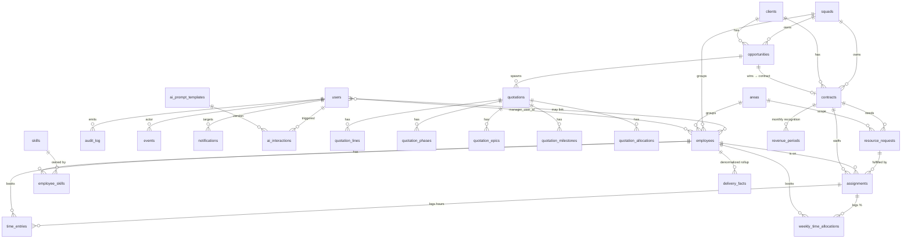

# Modelo de datos — DVPNYX Quoter

> **Estado:** Mayo 2026. Refleja el schema real en `server/database/migrate.js` después de la rama `chore/ai-readiness-foundations`.
> **Fuente de verdad:** el SQL del migrate. Si este documento se desfasa, el código gana.

Este documento describe **todo** lo que vive en la base de datos: tablas, columnas, constraints, índices, relaciones, decisiones de diseño y deudas conocidas.

---

## Índice

1. [Convenciones generales](#1-convenciones-generales)
2. [Diagrama de relaciones](#2-diagrama-de-relaciones)
3. [Tablas core](#3-tablas-core)
4. [Comercial: clients → opportunities → quotations](#4-comercial-clients--opportunities--quotations)
5. [Cotizador (legacy V1)](#5-cotizador-legacy-v1)
6. [Delivery: contracts → resource_requests → assignments](#6-delivery-contracts--resource_requests--assignments)
7. [Time tracking (dos modelos coexisten)](#7-time-tracking-dos-modelos-coexisten)
8. [Finanzas: revenue + exchange rates](#8-finanzas-revenue--exchange-rates)
9. [Personas: areas, skills, employees](#9-personas-areas-skills-employees)
10. [Auditoría: events + audit_log](#10-auditoría-events--audit_log)
11. [Notificaciones](#11-notificaciones)
12. [Capa AI-readiness](#12-capa-ai-readiness)
13. [Vistas materializadas + funciones](#13-vistas-materializadas--funciones)
14. [Pares de entidades duplicadas (tech debt activo)](#14-pares-de-entidades-duplicadas-tech-debt-activo)
15. [Glosario de columnas comunes](#15-glosario-de-columnas-comunes)

---

## 1. Convenciones generales

Toda tabla V2 sigue estas reglas:

| Aspecto | Regla |
|---|---|
| PK | `UUID` con `DEFAULT uuid_generate_v4()` salvo lookups (`areas`, `skills`, `parameters` que usan `SERIAL`) |
| Soft delete | `deleted_at TIMESTAMPTZ NULL`. Todo SELECT de producción incluye `WHERE deleted_at IS NULL` |
| Timestamps | `TIMESTAMPTZ NOT NULL DEFAULT NOW()` para `created_at` y `updated_at` |
| Autoría | `created_by UUID NOT NULL REFERENCES users(id)` (nullable sólo en lookups y notifications) |
| Estados | `VARCHAR(20)` con `CHECK (status IN (...))`. **No** usamos tipos `ENUM` de Postgres para no bloquear migraciones |
| Indexes en FKs | Índices parciales (`WHERE deleted_at IS NULL`) en columnas de lookup frecuente |
| JSONB | Para shapes que evolucionan. Validar con `utils/json_schema.js :: SCHEMAS` |
| Naming | `snake_case` en DB. API responses pueden mezclar pero documentamos como snake en specs |

**Tablas legacy V1** (`users`, `parameters`, `quotations`, `quotation_*`, `audit_log`) usan `TIMESTAMP` sin TZ y `SERIAL` para PKs auxiliares. Es deuda conocida — ver [§14](#14-pares-de-entidades-duplicadas-tech-debt-activo).

**Extensiones:**
- `uuid-ossp` (siempre): generación UUIDs.
- `vector` (opcional): si está disponible se crean columnas de embeddings; si no, se loguea warning y el resto migra.

---

## 2. Diagrama de relaciones



---

## 3. Tablas core

### `users` (V1, alterada en V2)

Identidad de login. Distinto de `employees` por diseño: un empleado puede no tener cuenta de login (contractor sin acceso al sistema), y un usuario puede no ser empleado (admin externo, CEO).

| Columna | Tipo | Notas |
|---|---|---|
| `id` | UUID PK | |
| `email` | VARCHAR(255) UNIQUE NOT NULL | |
| `password_hash` | VARCHAR(255) NOT NULL | bcrypt cost 12 |
| `name` | VARCHAR(255) NOT NULL | |
| `role` | VARCHAR(20) | CHECK: `superadmin` \| `admin` \| `lead` \| `member` \| `viewer` \| `preventa` (legacy) |
| `function` | VARCHAR(50) NULL | CHECK: `comercial` \| `preventa` \| `capacity_manager` \| `delivery_manager` \| `project_manager` \| `fte_tecnico` \| `people` \| `finance` \| `pmo` \| `admin` |
| `squad_id` | UUID NULL → squads | |
| `active` | BOOLEAN DEFAULT true | |
| `must_change_password` | BOOLEAN DEFAULT true | |
| `preferences` | JSONB DEFAULT '{}' | UI prefs: `scheme`, `accentHue`, `density`. Validar con `SCHEMAS.userPreferences` |
| `deleted_at` | TIMESTAMPTZ NULL | |
| `created_at`, `updated_at` | TIMESTAMP | **V1 legacy: sin TZ** |

**Roles:**
- `superadmin`: bypass total
- `admin`: CRUD en todas las entidades operativas
- `lead`: líder de equipo. Visibilidad de sus reportes directos vía `employees.manager_user_id = users.id`
- `member`: usuario estándar
- `viewer`: solo lectura
- `preventa`: legacy. Middleware `auth.js` reescribe a `member` + `function='preventa'` durante grace period

### `squads`

Agrupación organizacional. Hoy "ocultos" del UI (squad por defecto `DVPNYX Global` se autocrea). Decisión pendiente: dropear o exponer.

| Columna | Tipo | Notas |
|---|---|---|
| `id` | UUID PK | |
| `name` | VARCHAR(100) NOT NULL | UNIQUE (case-insensitive, partial WHERE deleted_at IS NULL) |
| `description` | TEXT NULL | |
| `active` | BOOLEAN DEFAULT true | |
| `deleted_at` | TIMESTAMPTZ NULL | |

### `parameters`

Catálogo de parámetros operativos. Categorías: `time_tracking`, `reports`, `utilization`, y otros del cotizador (cost rates, country deltas).

| Columna | Tipo |
|---|---|
| `id` SERIAL PK | |
| `category`, `key` | parte 1 y 2 de la PK lógica |
| `value` NUMERIC | |
| `label`, `note`, `sort_order`, `updated_at`, `updated_by` | |

UNIQUE: `(category, key)`.

---

## 4. Comercial: clients → opportunities → quotations

### `clients`

| Columna | Tipo | Notas |
|---|---|---|
| `id` | UUID PK | |
| `name` | VARCHAR(200) NOT NULL | UNIQUE (lower, partial) |
| `legal_name`, `country`, `industry` | | |
| `tier` | VARCHAR(50) NULL | CHECK: `enterprise` \| `mid_market` \| `smb` |
| `preferred_currency` | VARCHAR(3) DEFAULT 'USD' | |
| `notes`, `tags TEXT[]`, `external_crm_id` | | |
| `slug` | VARCHAR(120) NULL | UNIQUE partial. URL-friendly + LLM-friendly |
| `active` | BOOLEAN DEFAULT true | |
| `deleted_at`, `created_by`, `created_at`, `updated_at` | | |

### `opportunities`

Pipeline de venta. Estados drive Kanban (CRM-MVP-00.1).

| Columna | Tipo | Notas |
|---|---|---|
| `id` | UUID PK | |
| `client_id` | UUID NOT NULL → clients | |
| `name`, `description` | | |
| `account_owner_id` | UUID NOT NULL → users | |
| `presales_lead_id` | UUID NULL → users | |
| `squad_id` | UUID NOT NULL → squads | |
| `status` | VARCHAR(30) DEFAULT 'open' | CHECK: `open` \| `qualified` \| `proposal` \| `negotiation` \| `won` \| `lost` \| `cancelled` |
| `outcome` | VARCHAR(20) NULL | |
| `outcome_reason` | VARCHAR(50) NULL | CHECK: `price` \| `timing` \| `competition` \| `technical_fit` \| `client_internal` \| `other` |
| `outcome_notes` | TEXT NULL | |
| `expected_close_date`, `closed_at` | | |
| `winning_quotation_id` | UUID NULL → quotations | seteada al ganar |
| `booking_amount_usd` | NUMERIC(18,2) DEFAULT 0 | CRM-MVP |
| `probability` | NUMERIC(5,2) DEFAULT 5 | recalculada por trigger según status |
| `weighted_amount_usd` | NUMERIC(18,2) | trigger: `booking × probability / 100` |
| `last_stage_change_at` | TIMESTAMPTZ DEFAULT NOW() | |
| `next_step`, `next_step_due_date` | | |
| `tags`, `external_crm_id`, `slug` | | |
| `description_embedding` | vector(1536) NULL | si pgvector |
| `deleted_at`, `created_by`, `created_at`, `updated_at` | | |

**Trigger `opp_pipeline_recalc`** (BEFORE INSERT OR UPDATE):
- Recalcula `probability` cuando `status` cambia (5/20/50/75/100/0/0).
- Recalcula `weighted_amount_usd = booking × probability / 100`.
- Setea `last_stage_change_at = NOW()` cuando `status` cambia.

### `quotations` (V1, alterada en V2)

| Columna | Tipo | Notas |
|---|---|---|
| `id` | UUID PK | |
| `type` | VARCHAR(20) | CHECK: `staff_aug` \| `fixed_scope` |
| `version`, `parent_id` | INT, UUID NULL → quotations | versionado lineal |
| `status` | VARCHAR(20) DEFAULT 'draft' | CHECK: `draft` \| `sent` \| `approved` \| `rejected` \| `expired` |
| `project_name`, `client_name` | VARCHAR | `client_name` es legacy denormalizado; `client_id` es el FK real |
| `commercial_name`, `preventa_name` | | denormalizados |
| `validity_days`, `discount_pct` | INT, NUMERIC | |
| `notes`, `metadata JSONB` | | |
| `client_id` | UUID NULL → clients | V2 add |
| `opportunity_id` | UUID NULL → opportunities | V2 add |
| `squad_id` | UUID NULL → squads | V2 add |
| `currency` | VARCHAR(3) DEFAULT 'USD' | V2 add |
| `parameters_snapshot` | JSONB NULL | snapshot de params al cotizar |
| `sent_at` | TIMESTAMPTZ NULL | |
| `summary_embedding` | vector(1536) NULL | si pgvector |
| `deleted_at`, `created_by`, `created_at`, `updated_at` | | `*_at` siguen siendo TIMESTAMP V1 |

---

## 5. Cotizador (legacy V1)

5 tablas hijas de `quotations`. Todas con `ON DELETE CASCADE`.

### `quotation_lines`

Recursos cotizados. En staff_aug es la lista completa; en fixed_scope, los recursos asignables a phases.

| Columna | Tipo | Notas |
|---|---|---|
| `id` | UUID PK | |
| `quotation_id` | UUID NOT NULL → quotations CASCADE | |
| `sort_order` | INT | |
| `specialty` | VARCHAR(100) | mapeo heurístico a `areas.key` (ver `SPECIALTY_TO_AREA_KEY` en `routes/contracts.js`) |
| `role_title` | VARCHAR(255) | |
| `level` | INT 1..11 | **legacy INT**. V2 usa VARCHAR `L1..L11` |
| `country`, `bilingual`, `tools`, `stack`, `modality`, `phase` | | |
| `quantity` | INT DEFAULT 1 | CHECK: `>= 1` |
| `duration_months` | INT DEFAULT 6 | CHECK: `0..120` |
| `hours_per_week` | NUMERIC | CHECK: `0..168` |
| `cost_hour`, `rate_hour`, `rate_month`, `total` | NUMERIC | |

### `quotation_phases`

Fases de un proyecto fixed_scope. `id`, `quotation_id`, `sort_order`, `name`, `weeks INT`, `description`.

### `quotation_epics`

Épicas/módulos del proyecto.

| Columna | Tipo |
|---|---|
| `id`, `quotation_id`, `sort_order`, `name`, `priority` | |
| `hours_by_profile` JSONB | `{ "frontend": 80, "backend": 120 }` |
| `total_hours` NUMERIC | |

### `quotation_milestones`

Hitos de pago para fixed_scope.

| Columna | Tipo |
|---|---|
| `id`, `quotation_id`, `sort_order`, `name`, `phase` | |
| `percentage`, `amount`, `expected_date` | |
| `deleted_at` (V2 add) | |

### `quotation_allocations`

Distribución semanal de horas por (línea, fase). Promovido de JSONB a tabla en V2 (EX-4).

| Columna | Tipo |
|---|---|
| `id`, `quotation_id`, `line_sort_order`, `phase_id`, `weekly_hours`, `created_at` | |

UNIQUE: `(quotation_id, line_sort_order, phase_id)`.

---

## 6. Delivery: contracts → resource_requests → assignments

### `contracts`

Contrato firmado con un cliente. Distinto de quotation: la quotation es propuesta, el contract es ejecución.

| Columna | Tipo | Notas |
|---|---|---|
| `id` | UUID PK | |
| `name` | VARCHAR(200) NOT NULL | |
| `client_id` | UUID NOT NULL → clients | |
| `opportunity_id` | UUID NULL → opportunities | |
| `winning_quotation_id` | UUID NULL → quotations | base para kick-off |
| `type` | VARCHAR(20) | CHECK: `capacity` \| `project` \| `resell` |
| `contract_subtype` | VARCHAR(50) NULL | CHECK: 6 valores válidos. Coherencia con `type` validada en `routes/contracts.js` vía `utils/contract_subtype.js`. NULL para `resell`. **Obligatorio** al crear/editar capacity y project (excepción: legacy edits que no tocan type). Ver [SPEC subtipo-contrato](#contract_subtype-subtypes-spec) abajo |
| `status` | VARCHAR(20) DEFAULT 'planned' | CHECK: `planned` \| `active` \| `paused` \| `completed` \| `cancelled` |
| `start_date`, `end_date` | DATE | CHECK: `end >= start` |
| `account_owner_id` | UUID NOT NULL → users | |
| `delivery_manager_id` | UUID NULL → users | quien hace kick-off |
| `capacity_manager_id` | UUID NULL → users | |
| `squad_id` | UUID NOT NULL → squads | auto-resuelto si vacío |
| `notes`, `tags TEXT[]` | | |
| `metadata` | JSONB NULL | claves conocidas: `kick_off_date`, `kicked_off_at`, `kicked_off_by`, `kick_off_seeded_count`. Validar con `SCHEMAS.contractMetadata` |
| `total_value_usd` | NUMERIC(18,2) DEFAULT 0 | RR-MVP. Hoy editable libre |
| `original_currency` | VARCHAR(3) DEFAULT 'USD' | |
| `slug` | VARCHAR(160) NULL | UNIQUE partial |
| `context_embedding` | vector(1536) NULL | si pgvector |
| `deleted_at`, `created_by`, `created_at`, `updated_at` | | |

**Endpoint singular:** `POST /api/contracts/:id/kick-off` lee la winning_quotation y crea `resource_requests` automáticamente.

#### contract_subtype (subtypes spec)

Catálogo del campo `contract_subtype` (Abril 2026). Helper:
[`server/utils/contract_subtype.js`](../../../server/utils/contract_subtype.js) ·
[`client/src/utils/contractSubtype.js`](../../../client/src/utils/contractSubtype.js).

| `type` | Subtipos válidos (valor interno → etiqueta visible) |
|---|---|
| `capacity` | `staff_augmentation` → "Staff Augmentation" · `mission_driven_squad` → "Mission-driven squad" · `managed_service` → "Servicio administrado / Soporte" · `time_and_materials` → "Tiempo y Materiales" |
| `project`  | `fixed_scope` → "Alcance fijo / POC" · `hour_pool` → "Bolsa de horas" |
| `resell`   | (sin subtipos — siempre `NULL`) |

**Reglas de coherencia (server):**
- `type='capacity'` o `type='project'` + `contract_subtype=NULL` en POST → `400 code:'subtype_required'`
- `type='resell'` + `contract_subtype` no-null → `400 code:'subtype_not_allowed_for_resell'`
- subtype no en la lista del type → `400 code:'subtype_invalid_for_type'`
- En PUT: si el caller cambia el `type`, el subtype se requiere (no se hereda del type viejo)
- En PUT: contratos legacy con `subtype=NULL` pueden editar OTROS campos sin forzar subtype, salvo que el caller cambie type o pase subtype explícito.

**CHECK constraint en DB** valida los 6 valores válidos a nivel de schema; la coherencia con `type` queda en código (depende de otra columna).

### `resource_requests`

Necesidad de recursos para un contrato. Un row puede tener `quantity > 1`.

| Columna | Tipo | Notas |
|---|---|---|
| `id` | UUID PK | |
| `contract_id` | UUID NOT NULL → contracts CASCADE | |
| `role_title` | VARCHAR(150) NOT NULL | |
| `area_id` | INT NOT NULL → areas | |
| `level` | VARCHAR(5) NOT NULL | CHECK: `L1`..`L11` |
| `country` | VARCHAR(100) NULL | |
| `language_requirements` | JSONB NULL | array de `{language, level}`. Validar con `SCHEMAS.resourceRequestLanguageRequirements` |
| `required_skills`, `nice_to_have_skills` | INT[] | FKs a `skills.id` |
| `weekly_hours` | NUMERIC(5,2) DEFAULT 40 | CHECK: `0 < h <= 80` |
| `start_date`, `end_date` | DATE | CHECK: `end >= start` |
| `quantity` | INT DEFAULT 1 | CHECK: `>= 1` |
| `priority` | VARCHAR(20) DEFAULT 'medium' | CHECK: `low` \| `medium` \| `high` \| `critical` |
| `status` | VARCHAR(20) DEFAULT 'open' | CHECK: `open` \| `partially_filled` \| `filled` \| `cancelled`. Computado por código: `computeStatus(stored, active_assignments_count, quantity)` |
| `notes` | TEXT | |
| `requirements_embedding` | vector(1536) NULL | si pgvector |
| `deleted_at`, `created_by`, `created_at`, `updated_at` | | |

### `assignments`

Empleado asignado a un resource_request. **El plan**.

| Columna | Tipo | Notas |
|---|---|---|
| `id` | UUID PK | |
| `resource_request_id` | UUID NOT NULL → resource_requests | |
| `employee_id` | UUID NOT NULL → employees | |
| `contract_id` | UUID NOT NULL → contracts | redundante con request.contract_id; chequeado por código |
| `weekly_hours` | NUMERIC(5,2) | CHECK: `0 < h <= 80` |
| `start_date`, `end_date` | DATE | CHECK: `end >= start` |
| `status` | VARCHAR(20) DEFAULT 'planned' | CHECK: `planned` \| `active` \| `ended` \| `cancelled` |
| `role_title`, `notes` | | |
| `approval_required`, `approved_at`, `approved_by` | | aspirational, no enforced |
| `override_reason` | TEXT NULL | justificación cuando admin bypassea validación |
| `override_checks` | JSONB NULL | snapshot de validaciones falladas — para que la IA aprenda |
| `override_author_id`, `override_at` | | |
| `deleted_at`, `created_by`, `created_at`, `updated_at` | | |

**Validación al crear** (en `routes/assignments.js`):
1. `runAllChecks()` desde `utils/assignment_validation.js` → área match, level gap, capacity, overlap.
2. Overbooking si suma supera `weekly_capacity_hours × 1.10` → 409 salvo override.
3. Status del empleado: `terminated` rechaza; `bench`/`on_leave` warn.

---

## 7. Time tracking (dos modelos coexisten)

### `time_entries` (modelo daily)

Una row = horas trabajadas por empleado en un día contra una asignación.

| Columna | Tipo | Notas |
|---|---|---|
| `id`, `employee_id`, `assignment_id` | | |
| `work_date` | DATE | |
| `hours` | NUMERIC(5,2) | CHECK: `0 < h <= 24` |
| `description`, `status` | | CHECK: `draft` \| `submitted` \| `approved` \| `rejected` |
| `approved_at`, `approved_by`, `rejection_reason` | | |
| `deleted_at`, `created_by`, `created_at`, `updated_at` | | |

UI: `/time/me` (matriz semanal).

### `weekly_time_allocations` (modelo weekly %)

Una row = % de la semana del empleado dedicado a una asignación. Bench se calcula `100 - SUM(pct)`, no se persiste.

| Columna | Tipo | Notas |
|---|---|---|
| `id`, `employee_id`, `assignment_id` | | |
| `week_start_date` | DATE | siempre lunes (normalizado por `mondayOf` en `utils/sanitize.js`) |
| `pct` | NUMERIC(5,2) | CHECK: `0..100` |
| `notes`, `created_by`, `updated_by`, `created_at`, `updated_at` | | |

UNIQUE: `(employee_id, week_start_date, assignment_id)`.

UI: `/time/team`.

> **Tech debt activo:** estos dos modelos coexisten por decisión de no-bloqueo. Eng team consolida según [`DECISIONS.md :: time-tracking-model`](../../DECISIONS.md).

---

## 8. Finanzas: revenue + exchange rates

### `revenue_periods`

Reconocimiento mensual de ingresos por contrato.

| Columna | Tipo | Notas |
|---|---|---|
| `contract_id` | UUID NOT NULL → contracts CASCADE | parte 1 PK |
| `yyyymm` | CHAR(6) | parte 2 PK. CHECK: `^[0-9]{6}$` |
| `projected_usd` | NUMERIC(18,2) | si type='project': se usa `projected_pct × contracts.total_value_usd` |
| `projected_pct` | NUMERIC(7,4) NULL | 0..1, sólo para type='project' |
| `real_usd`, `real_pct` | | NULL hasta cerrar período |
| `status` | VARCHAR(20) DEFAULT 'open' | `open` \| `closed` |
| `notes`, `closed_at`, `closed_by`, `created_by`, `updated_by`, `created_at`, `updated_at` | | |

PK compuesta: `(contract_id, yyyymm)`.

> **Inmutabilidad pendiente:** rows con `status='closed'` deberían ser inmutables (NIIF 15). Hoy depende del código no permitir UPDATE a closed — sin trigger DB.

### `employee_costs`

Costo empresa mensual real por empleado. Spec original: `spec_costos_empleado.docx` (Abril 2026). PII salarial, acceso restringido a admin/superadmin.

| Columna | Tipo | Notas |
|---|---|---|
| `id` | UUID PK | |
| `employee_id` | UUID NOT NULL → employees | **`ON DELETE RESTRICT`** — historial financiero inmutable |
| `period` | CHAR(6) | `^[0-9]{6}$` (YYYYMM, alineado con exchange_rates / revenue_periods) |
| `currency` | VARCHAR(3) | CHECK: `USD` \| `COP` \| `MXN` \| `GTQ` \| `EUR` |
| `gross_cost` | NUMERIC(14,2) | CHECK: `>= 0`. Costo total en moneda original |
| `cost_usd` | NUMERIC(14,2) NULL | calculado vía `cost_usd = gross_cost / usd_rate(period, currency)`. NULL si no hay tasa |
| `exchange_rate_used` | NUMERIC(18,8) NULL | snapshot de la tasa usada (auditoría). NO se actualiza automáticamente cuando cambia exchange_rates |
| `locked` | BOOLEAN DEFAULT false | true = período cerrado contablemente |
| `locked_at`, `locked_by` | | quien cerró el período |
| `source` | VARCHAR(20) | CHECK: `manual` \| `payroll_sync` \| `csv_import` \| `copy_from_prev` \| `projected` |
| `notes` | TEXT NULL | |
| `created_by`, `updated_by`, `created_at`, `updated_at` | | |

UNIQUE: `(employee_id, period)`. Indexes: `period`, `employee_id`, `(period, locked)`, parcial `WHERE locked = false`.

**Conversión USD:** convención compartida con `exchange_rates` — `1 USD = N <currency>`, por lo tanto `cost_usd = gross_cost / usd_rate`. Para `currency='USD'`, `usd_rate=1.0` implícito y `cost_usd = gross_cost`.

**Reglas de coherencia:**
- Period >= mes de inicio del empleado.
- Period <= mes de fin (si está terminado).
- Period dentro del rango permitido (default ≤ +1 mes hacia adelante).
- Row `locked=true` requiere superadmin para editar/borrar.

**Eventos emitidos:** `employee_cost.created` / `.updated` / `.deleted` / `.locked` / `.unlocked` / `.recalculated_after_fx_change` / `.bulk_committed` / `.copied_from_previous`.

> **Deprecación**: `employees.company_monthly_cost`, `hourly_cost`, `cost_currency`, `cost_updated_at`, `cost_updated_by` quedan deprecadas (COMMENT ON COLUMN). La fuente de verdad es `employee_costs`.

### `exchange_rates`

Tasas mensuales tipo "USD<currency>". Convención: `usd_rate = N` ⟹ `1 USD = N <currency>`.

| Columna | Tipo |
|---|---|
| `yyyymm`, `currency`, `usd_rate NUMERIC(18,8)` | PK = `(yyyymm, currency)` |
| `notes`, `updated_by`, `updated_at` | |

USD propio NO vive aquí — código asume rate=1.0 implícito.

**Conversión A → B en período Y:**
```
amount_in_USD = amount_in_A / usd_rate(Y, A)   (o = amount_in_A si A=USD)
amount_in_B   = amount_in_USD × usd_rate(Y, B) (o = amount_in_USD si B=USD)
```

Si no hay rate del período, fallback al último disponible (LATERAL JOIN en query).

---

## 9. Personas: areas, skills, employees

### `areas`

| Columna | Tipo |
|---|---|
| `id SERIAL PK`, `key VARCHAR(50) UNIQUE`, `name VARCHAR(100)` | |
| `description`, `narrative TEXT` | enriquecimiento RAG |
| `narrative_embedding vector(1536)` | si pgvector |
| `sort_order`, `active`, `created_at` | |

Seeds: 9 áreas DVPNYX (`development`, `infra_security`, `testing`, `product_management`, `project_management`, `data_ai`, `ux_ui`, `functional_analysis`, `devops_sre`).

### `skills`

| Columna | Tipo |
|---|---|
| `id SERIAL PK`, `name VARCHAR(100) UNIQUE` (case-insensitive), `category VARCHAR(50)` | |
| `description`, `narrative` | |
| `name_embedding vector(1536)` | si pgvector |
| `active`, `created_at` | |

Seeds: ~60 skills en 8 categorías (language, framework, cloud, data, ai, tool, methodology, soft).

### `employees`

| Columna | Tipo | Notas |
|---|---|---|
| `id` | UUID PK | |
| `user_id` | UUID NULL UNIQUE → users | NULL si no tiene cuenta de login |
| `first_name`, `last_name` | VARCHAR | |
| `personal_email`, `corporate_email` | VARCHAR | corporate UNIQUE (lower, partial) |
| `country`, `city` | VARCHAR | |
| `area_id` | INT NOT NULL → areas | |
| `level` | VARCHAR(5) | CHECK: `L1`..`L11` |
| `seniority_label` | VARCHAR(50) | |
| `employment_type` | VARCHAR(20) DEFAULT 'fulltime' | CHECK: `fulltime` \| `parttime` \| `contractor` |
| `weekly_capacity_hours` | NUMERIC(5,2) DEFAULT 40 | CHECK: `0..80` |
| `languages` | JSONB DEFAULT '[]' | |
| `start_date` | DATE NOT NULL | |
| `end_date` | DATE NULL | terminación |
| `status` | VARCHAR(20) DEFAULT 'active' | CHECK: `active` \| `on_leave` \| `bench` \| `terminated` |
| `squad_id` | UUID NULL → squads | |
| `manager_user_id` | UUID NULL → users | líder directo (rol `lead` lo usa para scoping) |
| `notes`, `tags TEXT[]` | | |
| `company_monthly_cost`, `hourly_cost`, `cost_currency`, `cost_updated_at`, `cost_updated_by` | | reservados para finanzas (V2 los deja NULL) |
| `slug` | VARCHAR(160) NULL | UNIQUE partial |
| `skill_profile_embedding` | vector(1536) NULL | si pgvector |
| `deleted_at`, `created_by`, `created_at`, `updated_at` | | |

### `employee_skills`

Tabla puente con proficiency.

| Columna | Tipo |
|---|---|
| `id`, `employee_id`, `skill_id`, `proficiency` (CHECK: `beginner` \| `intermediate` \| `advanced` \| `expert`) | |
| `years_experience NUMERIC(4,1)`, `notes`, `created_at` | |

UNIQUE: `(employee_id, skill_id)`. ON DELETE CASCADE desde employee.

---

## 10. Auditoría: events + audit_log

### `events` (V2, target)

Append-only. Estructurada. Indexada por entidad/actor/tipo/fecha.

| Columna | Tipo |
|---|---|
| `id`, `event_type` | snake.case: `contract.created`, `assignment.overbooked`, `contract.kicked_off` |
| `entity_type`, `entity_id`, `actor_user_id` | |
| `payload JSONB`, `ip_address INET`, `user_agent` | |
| `created_at` | |

Emite vía `utils/events.js :: emitEvent(pool, ...)`.

### `audit_log` (V1, legacy)

| Columna | Tipo |
|---|---|
| `id SERIAL`, `user_id`, `action`, `entity`, `entity_id`, `details JSONB`, `ip_address`, `created_at` | |

> **Tech debt activo:** `events` debe reemplazar `audit_log` gradualmente. Hoy ambos se escriben en flows distintos. **No agregar features nuevos a `audit_log`.**

---

## 11. Notificaciones

### `notifications`

In-app, asíncronas, leídas con `read_at IS NULL`.

| Columna | Tipo |
|---|---|
| `id UUID`, `user_id`, `type`, `title`, `body`, `link` | |
| `entity_type`, `entity_id` | |
| `read_at`, `created_at` | |

Index: `notifications(user_id) WHERE read_at IS NULL`.

---

## 12. Capa AI-readiness

Agregada en Mayo 2026. Aditiva, no rompe nada existente.

### `ai_interactions`

Log estructurado de cada llamada a un agente.

| Columna | Tipo | Notas |
|---|---|---|
| `id` | UUID PK | |
| `agent_name`, `agent_version` | VARCHAR | ej. `claude-sonnet-4.5`, `20251015` |
| `prompt_template`, `prompt_template_version` | VARCHAR, INT | FK lógica a `ai_prompt_templates` |
| `user_id` | UUID NULL → users | quien disparó |
| `entity_type`, `entity_id` | | sobre qué entidad opera |
| `input_payload` | JSONB | prompt + contexto (REDACTED — sin PII directa) |
| `output_payload` | JSONB | respuesta |
| `confidence` | NUMERIC(4,3) NULL | CHECK: `0..1` |
| `human_decision` | VARCHAR(20) NULL | CHECK: `accepted` \| `rejected` \| `modified` \| `ignored` \| `pending`. NULL = no decidido |
| `human_feedback` | TEXT | |
| `cost_usd`, `input_tokens`, `output_tokens`, `latency_ms` | | observabilidad |
| `error` | TEXT NULL | si la llamada falló |
| `created_at`, `decided_at` | | |

Indexes: `user_id`, `(entity_type, entity_id)`, `(prompt_template, version)`, `created_at DESC`.

**Cómo se usa:** `utils/ai_logger.js :: run({ pool, agent, template, userId, entity, input, call })`. Ver [`AI_INTEGRATION_GUIDE.md`](../../AI_INTEGRATION_GUIDE.md).

### `ai_prompt_templates`

Versionado de prompts.

| Columna | Tipo |
|---|---|
| `id UUID`, `name`, `version INT` | UNIQUE `(name, version)` |
| `description`, `body TEXT`, `output_schema JSONB` | |
| `active BOOLEAN`, `created_by`, `created_at` | |

Index: activos por nombre — `WHERE active = true`.

### `delivery_facts`

Tabla denormalizada por (fact_date, employee_id) para forecasting.

| Columna | Tipo |
|---|---|
| `fact_date DATE`, `employee_id UUID` | PK compuesta |
| `capacity_hours`, `planned_hours`, `planned_pct`, `actual_pct`, `bench_pct` | NUMERIC |
| `utilization`, `is_overbooked` | NUMERIC, BOOLEAN |
| `area_id`, `area_name`, `squad_id`, `level`, `country` | snapshot dimensional |
| `refreshed_at` | |

Refresca con `SELECT refresh_delivery_facts('2026-04-01'::date, '2026-04-30'::date)`.

### Embeddings (pgvector)

Columnas `vector(1536)` agregadas si pgvector disponible:

| Tabla | Columna |
|---|---|
| `skills` | `name_embedding` |
| `areas` | `narrative_embedding` |
| `employees` | `skill_profile_embedding` |
| `resource_requests` | `requirements_embedding` |
| `opportunities` | `description_embedding` |
| `contracts` | `context_embedding` |
| `quotations` | `summary_embedding` |

Indexes HNSW con `vector_cosine_ops`.

Si la extensión `vector` no está instalada en la imagen postgres, el migrate emite warning pero el resto del schema migra normalmente.

---

## 13. Vistas materializadas + funciones

### `mv_plan_vs_real_weekly`

Pre-calcula plan-vs-real semanal por (employee, week, assignment).

```sql
SELECT employee_id, week_start_date, assignment_id, contract_id, contract_name,
       role_title, planned_hours, planned_pct, actual_pct, diff_pct, notes, updated_at
FROM mv_plan_vs_real_weekly;

-- Refrescar (no se hace automático)
REFRESH MATERIALIZED VIEW CONCURRENTLY mv_plan_vs_real_weekly;
```

UNIQUE INDEX en `(employee_id, week_start_date, assignment_id)` permite `REFRESH CONCURRENTLY` (sin lock de lectura).

### Función `refresh_delivery_facts(p_from DATE, p_to DATE) → INT`

PL/pgSQL. Idempotente: borra+inserta el rango. Devuelve número de rows insertados. Pensada para cron job nocturno (no ejecutado por DDL).

```sql
SELECT refresh_delivery_facts(CURRENT_DATE - 30, CURRENT_DATE);
```

---

## 14. Pares de entidades duplicadas (tech debt activo)

| Par | Por qué | Plan |
|---|---|---|
| `audit_log` (V1) ↔ `events` (V2) | Migración gradual nunca completada | Cuando se toque audit, mover writes restantes a `events` y dejar `audit_log` read-only |
| `time_entries` (daily hours) ↔ `weekly_time_allocations` (weekly %) | Dos modelos de time tracking que coexisten por decisión de no-bloqueo | Eng team consolida (decisión producto + migración data) |
| `quotations.client_name VARCHAR` ↔ `quotations.client_id UUID` | El nombre quedó como denormalizado legacy | Cuando se toque cotizador, derivar nombre del FK |
| `quotation_lines.level INT` ↔ `employees.level VARCHAR L1..L11` | Legacy V1 vs spec V2. Mapeado por `utils/level.js` | Si se reescribe quotation lines, unificar a VARCHAR |
| `users` (login) ↔ `employees` (PII operacional) | Por **diseño**: empleado puede no tener login | NO consolidar — mantener separados |

---

## 15. Glosario de columnas comunes

| Columna | Significado |
|---|---|
| `id UUID` | Primary key generada por `uuid_generate_v4()` (extension `uuid-ossp`) |
| `created_at`, `updated_at` | TIMESTAMPTZ. V1 usa TIMESTAMP sin TZ |
| `created_by`, `updated_by` | UUID → users(id). NULL sólo en lookups |
| `deleted_at` | TIMESTAMPTZ NULL. Soft delete. **Siempre** filtrar `WHERE deleted_at IS NULL` |
| `status` | VARCHAR con CHECK constraint específico. Lifecycle propio por entidad |
| `metadata`, `payload`, `*_snapshot` | JSONB libre. Validar contra `SCHEMAS` de `utils/json_schema.js` |
| `tags` | TEXT[] para tags libres |
| `slug` | VARCHAR URL-friendly. UNIQUE partial. Generado con `utils/slug.js` |
| `*_embedding` | vector(1536). NULL si pgvector no disponible o no se ha generado |
| `external_*_id` | ID en sistema externo (CRM, contabilidad). Free-form, no FK |

---

## Cambios recientes a este documento

- **2026-05**: Reescrito completo. Capa AI-readiness, materialized view, slugs, embeddings, CHECK constraints adicionales.
- **2026-04**: V2 schema documentado, weekly_time_allocations agregado.

> **Mantenimiento:** cualquier cambio en `migrate.js` debe reflejarse aquí en el mismo PR. Regla #1 de gobierno técnico.
